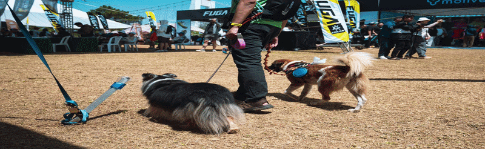

# Vision-Language Model Augmentation & Keyframe Evaluation Pipeline

[](https://raihhann.github.io/vlm-augmentation-pipeline/)
[](https://www.python.org/)
[](https://www.uni-stuttgart.de/)
[]()

<p align="center">
  
</p>

<p align="center">
  <em>Photo by <a href="https://unsplash.com">Zero</a> on <a href="https://unsplash.com">Unsplash</a></em>
</p>

<p align="center">
  <a href="./resources/main.pdf"></a>
  <a href="./resources/Porject Presentation.pptx"></a>
  <a href="https://raihhann.github.io/vlm-augmentation-pipeline/"></a>
</p>

---

## 🎯 The Problem & Motivation

Deploying Vision-Language Models (VLMs) on autonomous mobile robots is severely constrained by the strict computational, memory, and thermal limits of edge hardware. While fine-tuning or retraining foundation models for adverse operational environments is impractical on embedded platforms, compact edge decoders frequently suffer from spatial grounding deficits, resolution downsampling loss, and temporal redundancy in continuous video streams. 

This project investigates an inference-time visual preprocessing architecture designed to enhance VLM scene comprehension and downstream reasoning without modifying underlying model weights.

---

## 🚀 What This Software Is About

This repository contains research software developed at the **University of Stuttgart** (Institute of Industrial Automation and Software Engineering) that implements a unified framework to:
* **Isolate visual perturbations:** Apply targeted task-aware spatial prompting techniques including Context-Aware Zoom (CAZ), Query-Aware Bounding Box (QABB), Semantic Hazard Isolation (SHI), and Perception Metric Grounding (PMG).
* **Optimize temporal video sampling:** Execute dual-track query-aware video keyframe extraction pipelines (QA-IF and Smart Sampling) to prevent downstream edge VLM token saturation.
* **Quantify semantic performance:** Automatically benchmark original versus processed outputs using rigorous linguistic, visual, timing, and token-level metrics (BERTScore, BLEU, and CLIPScore) alongside an automated multi-agent debate evaluation jury.

---

## 🏗️ Repository Architecture

```text
Software/
├── README.md                       # Project-wide documentation & research guide
├── requirements.txt                # Complete Python dependency list
├── backend/                        # FastAPI core and evaluation engine
│   ├── main.py                     # Asynchronous FastAPI server & SSE generator
│   ├── config.py                   # Model registry & selectable processing methods
│   ├── inference.py                # Local Ollama/VLM inference adapter
│   ├── evaluation.py               # BERTScore, BLEU, CLIPScore, latency, & token analytics
│   ├── augmentation.py             # Modular image augmentation dispatcher
│   └── Augmentify/                 # Advanced augmentations & video keyframe strategies
│       ├── augment/                # Spatial visual prompt engines (CAZ, QABB, SHI, PMG)
│       ├── FramesExtraction/       # Video keyframe samplers (QA-IF, Smart Sampling, etc.)
│       └── Futurework/             # Abstract templates & experimental stubs
├── frontend/                       # Web-based interactive study dashboards
│   ├── index.html                  # Manual single-item evaluation studio
│   ├── excel_evaluator.html        # Automated dataset batch runner (.xlsx/.csv)
│   └── dashboard.html              # Results analytics & export studio
├── HPC Scripts/                    # High-Performance Computing evaluation scripts
│   ├── debate_syste.py             # Heterogeneous multi-agent debate consensus framework
│   └── LLM_as_Judge.py             # Automated semantic correctness grading pipeline
├── resources/                      # Research paper PDF, presentation slides, and demo assets
├── models/                         # Local model weights and tracking checkpoints
└── static/                         # Runtime uploaded media and cached CSV results
```

---

## 📊 Evaluation Metrics

The backend (`backend/evaluation.py`) performs automated multi-modal scoring comparing baseline model responses against augmented or processed inferences across five core analytical dimensions:
* **BERTScore F1:** Measures contextual semantic similarity against ground-truth descriptions using contextual token embeddings.
* **BLEU:** Computes smoothed n-gram precision overlap.
* **CLIPScore:** Evaluates reference-free image-text alignment scaled via weighted visual embeddings to detect cross-modal visual hallucinations.
* **Latency Delta ($\Delta t$):** Isolates net computational overhead introduced by visual transformations.
* **Token Output Volume:** Tracks exact subword generation volume to measure token processing economy.

---

## 🛠️ Installation & Setup

### 1. Prerequisites
* **Python 3.10+** recommended.
* [Ollama](https://ollama.com/) installed locally for running target VLMs (e.g., `qwen3-vl:4b`, `llava-phi3`).
* Sufficient local storage under `models/` for checkpoints.

### 2. Environment Setup
Clone the repository and configure your virtual environment from the root directory:

```powershell
python -m venv .venv
.\.venv\Scripts\Activate.ps1
python -m pip install --upgrade pip
python -m pip install -r requirements.txt
```

### 3. Running the Backend Server
Navigate to the backend directory and launch the FastAPI server via Uvicorn:

```powershell
cd backend
python -m uvicorn main:app --reload
```

Open **`http://127.0.0.1:8000`** in your browser to access the local web interface.

---

## 🌐 Interactive Documentation

Explore full API references, module breakdowns, and code-level documentation generated live via `pdoc`:

👉 **[View Live Documentation Site](https://raihhann.github.io/vlm-augmentation-pipeline/)**

---

## 🔬 Experimental Workflows & Features

The framework provides both manual single-sample validation and batch spreadsheet evaluation studios:
* **Task-Aware Spatial Prompts:** Includes Context-Aware Zoom (CAZ), Query-Aware Bounding Box (QABB), Semantic Hazard Isolation (SHI), and Perception Metric Grounding (PMG).
* **Query-Aware Video Keyframing:** Features dual-track extraction pipelines consisting of Codec-Level I-Frame Demuxing with Dense Grounding (QA-IF) and Smart Sampling.
* **Dataset Batch Studio (`/excel_studio`):** Upload CSV/Excel batches to run repeatable matrix evaluations across multi-column prompts and files with real-time Server-Sent Events (SSE) streaming.

---

## 📝 Citation & Research Status

This software is maintained as an open-ended research prototype for academic experimentation at the University of Stuttgart. If you utilize this pipeline or extensions of it in your academic work, please consult the project authors or reference the included research paper under `./resources/main.pdf`.